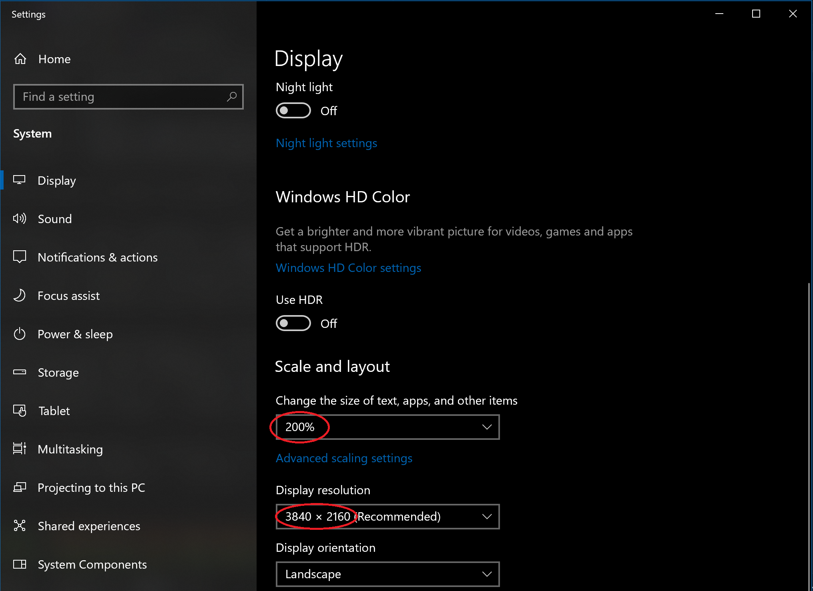
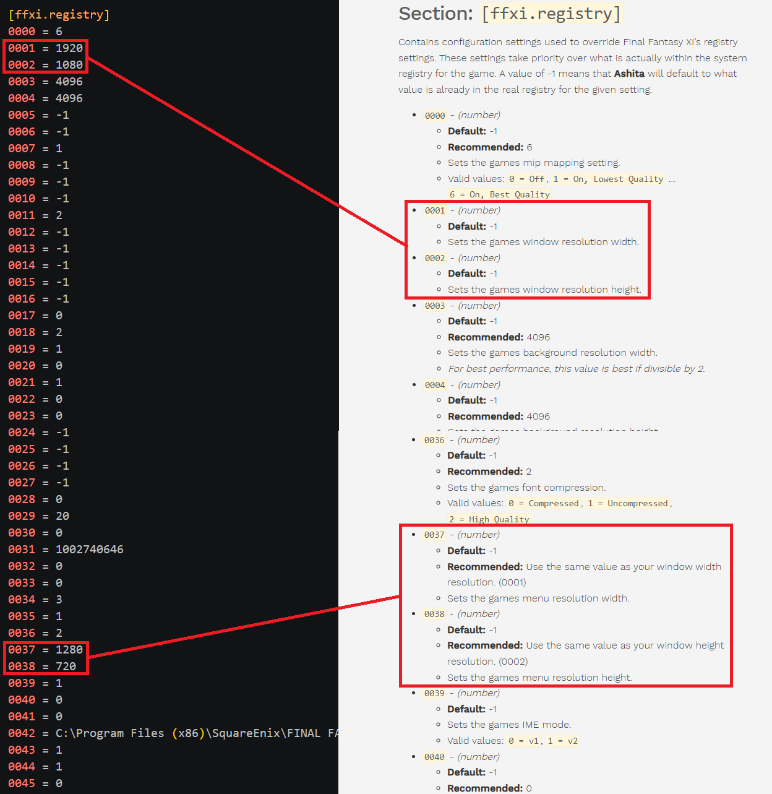

# imguiscale

Ashita v4 plugin that maps ImGui mouse coordinates from window client space to the Direct3D render resolution.

When the FFXI client window size does not match the D3D viewport, ImGui still receives mouse coordinates in window client space while drawing in render space. This causes ImGui hit-testing to drift from the cursor, and consequently mouse events like click, drag, and hover miss the widgets under the cursor. 

**imguiscale** corrects that so ImGui UIs track the mouse correctly.


## How it works

Scales ImGui mouse position, previous position, delta, and click positions by `render_size / client_size`.

Each frame the plugin:

1. Reads the D3D8 viewport and the FFXI window client rect
2. Computes scale factors when they differ from `1.0`
3. Applies those factors to mouse coordinates used by ImGui
4. If ImGui reports `WantCaptureMouse`, sets Ashita mouse `BlockInput` for that period so clicks/drags do not reach the game


Note: Scaling is inactive when client size and render size already match.

## Installation

1. Build the plugin (see below), or copy a prebuilt `imguiscale.dll`.
2. Place `imguiscale.dll` in your Ashita `plugins` folder.
3. Load it:

```
/load imguiscale
```

There are no slash commands. Load the plugin and it runs automatically.


## Building

From `plugins/imguiscale`:

```bat
cmake --preset win32-release
cmake --build --preset win32-release
```

The Release DLL is written to `build/Release/imguiscale.dll`.

The `win32-release` preset expects the Ashita SDK at `../sdk` relative to this plugin. Override with:

```bat
cmake --preset win32-release -DASHITA4_SDK_PATH=C:/path/to/Ashita/plugins/sdk
```

## Backstory

I use a 4K display but for me the native resolution makes everything too small. Using 200% scaling gives me the exact physical workspace size of a standard 1080p screen but with incredible visual clarity and perfectly smooth text & icons. 



I also set Ashita’s `[ffxi.registry]` **menu resolution** (`0037` / `0038`) lower than the **window resolution** (`0001` / `0002`) so the in-game UI appears larger. So I run the window at `1920×1080` with menu at  `1280×720`. Ashita’s docs recommend matching those values because it means client size and D3D viewport no longer line up 1:1.




